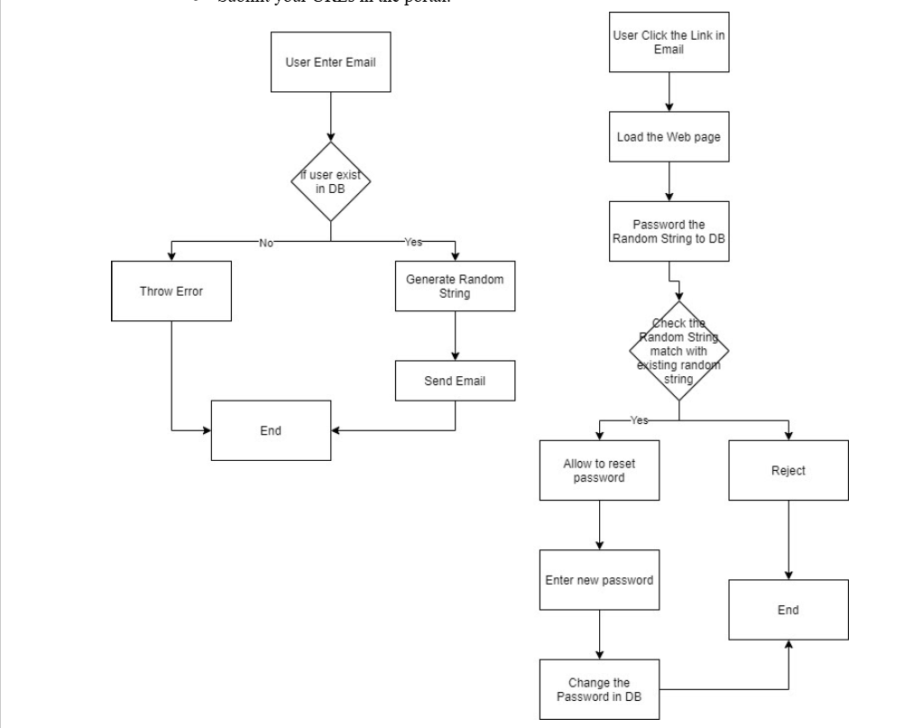

# Password Reset Flow

I built this project to implement a secure and efficient password reset flow using **Nodemailer** for email verification. The system ensures that users can reset their passwords only after verifying their identity via a unique reset link sent to their email. 

## How It Works

When a user forgets their password, they enter their email address on the **Forgot Password** page. The system checks if the user exists in the database. If not, an error message is displayed. If the user is found, a unique random string is generated and sent to their email using **Nodemailer**.

The system stores this random string in the database for verification. When the user clicks the link in their email, the system retrieves the string and validates it. If it matches, the user is presented with the password reset form. Once they enter a new password, the system updates it in the database and clears the random string to prevent reuse. 

To ensure security, the reset link has an expiration time. If the user tries to use an expired link, an alert is displayed, and they must request a new one.



## Technologies Used

- **Front-end:** React
- **Back-end:** Node.js with **Nodemailer** for email verification and tech stack = jwt,express,mongodb
- **UI Framework:** ThirdParty ui components for responsiveness

## Nodemailer Integration

I used **Nodemailer** to handle email verification. email configurations:
   ```env
   EMAIL_HOST=smtp.example.com
   EMAIL_PORT=587
   EMAIL_USER=your-email@example.com
   EMAIL_PASS=your-email-password
   ```


This project follows clean coding practices, ensuring maintainability and scalability. The password reset system enhances security and user experience, preventing unauthorized access and ensuring smooth account recovery.
